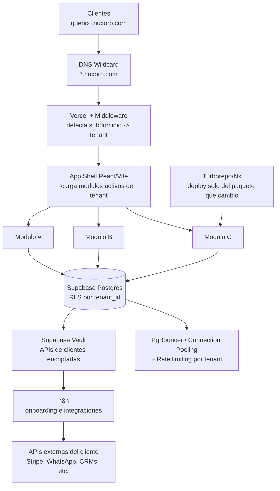

# Nuxorb — Arquitectura SaaS multi-modulo y multi-cliente

> Documento de referencia tecnica. Este archivo describe como esta pensada la plataforma Nuxorb para que se use como contexto al desarrollar con Claude Code.

## Resumen para el equipo (sin tecnicismos)

- Vendemos un software (SaaS) dividido en modulos, como piezas de Lego. Cada cliente compra los modulos que necesita, y cada modulo tiene 3 niveles: basico, intermedio y personalizado, cada uno con su propio precio.
- Cada cliente tiene su propio espacio dentro de nuestro dominio, por ejemplo `querico.nuxorb.com`. Es como cuando alguien crea su tienda en una plataforma tipo Shopify: usan el dominio de la plataforma, pero con su nombre.
- Cuando activamos un cliente nuevo, se crea automaticamente su usuario, se le prenden los modulos que compro y queda listo para usarse, sin trabajo manual repetitivo.
- La plataforma esta construida para que actualizar o arreglar un modulo no afecte a los demas modulos ni a los demas clientes. Cada pieza se despliega por separado.
- Cada cliente tiene su informacion separada y protegida de los demas, aunque compartan la misma plataforma. Como un edificio de departamentos: mismo edificio, pero cada quien con su puerta y su llave.
- Si un cliente conecta sus propias herramientas (WhatsApp Business, Stripe, etc.), esas claves quedan guardadas encriptadas. Nadie las ve en texto plano, ni nosotros.
- Todo esto esta pensado para crecer de 3 clientes a 20, 50 o 100 sin rehacer la plataforma desde cero.

---

## 1. Modelo de modulos y planes

La plataforma se vende como SaaS con modulos independientes. Cada modulo tiene tres niveles de servicio (basico, intermedio, personalizado), cada uno con su propio costo. Un cliente puede combinar los modulos que necesite.

| Elemento | Descripcion |
|---|---|
| Modulo | Unidad de funcionalidad vendible (ej. Reservas, Inventario, CRM) |
| Nivel | Basico / Intermedio / Personalizado, cada uno con precio distinto |
| Tenant | Cada cliente contratado (ej. Querico) con su propio espacio aislado |
| Subdominio | `cliente.nuxorb.com`, generado automaticamente al dar de alta al tenant |

---

## 2. Subdominios por cliente (estilo Vercel)

Cada cliente obtiene un subdominio bajo `nuxorb.com`, por ejemplo `querico.nuxorb.com`. No es necesario comprar un dominio nuevo por cada cliente.

- Se configura un **DNS wildcard** (`*.nuxorb.com`) que apunta a la infraestructura de despliegue.
- En el hosting (Vercel) se agrega el dominio wildcard al proyecto.
- Un **Middleware** lee el subdominio de cada solicitud (`querico`) y carga la configuracion de ese tenant: que modulos tiene activos, su marca, sus datos.
- Si un cliente grande pide su propio dominio (ej. `app.querico.com`), se apunta con un registro **CNAME** hacia la plataforma, sin duplicar infraestructura.

---

## 3. Despliegues independientes por modulo

Problema a evitar: en un monolito clasico, cualquier cambio redespliega toda la aplicacion, arriesgando romper modulos que no se tocaron.

Solucion:

- **Monorepo modular** con Turborepo o Nx: cada modulo vive como un paquete independiente dentro del mismo repositorio (`modulo-inventario`, `modulo-reservas`, etc).
- Turborepo/Vercel detectan automaticamente que paquete cambio y solo despliegan ese paquete, no la plataforma completa.
- El **App Shell** (aplicacion principal de cada tenant) carga dinamicamente los modulos que el cliente tiene activos, leyendo la tabla `tenant_modules` en la base de datos.
- Si en el futuro el trafico crece mucho (aprox. 50-100+ clientes), cada modulo puede evolucionar a microservicio independiente con su propio despliegue (Docker, Railway, etc). Para el arranque, el monorepo modular es suficiente y mas simple de mantener.

**Estructura de referencia del monorepo:**

```
nuxorb/
├── apps/
│   └── shell/              # App principal, carga modulos segun el tenant
├── packages/
│   ├── modulo-reservas/
│   ├── modulo-inventario/
│   ├── modulo-crm/
│   └── ui-shared/          # Componentes compartidos entre modulos
├── turbo.json
└── package.json
```

---

## 4. Base de datos: aislamiento y seguridad entre clientes

| Nivel | Como funciona | Cuando usarlo |
|---|---|---|
| Base compartida + RLS | Una sola base de datos, cada fila tiene `tenant_id`. Row Level Security impide que un cliente vea filas de otro. | **Recomendado para empezar.** Estandar de SaaS como Notion o Linear en sus inicios. |
| Schema por tenant | Mismo servidor Postgres, pero cada cliente tiene su propio schema. | Clientes que piden mayor aislamiento sin costo de infraestructura extra. |
| Proyecto/BD por tenant | Cada cliente tiene su propia instancia de base de datos. | Solo clientes enterprise que exijan cumplimiento especifico. Caro de mantener con muchos clientes. |

**Recomendacion:** iniciar con base compartida y RLS bien configurado. Es seguro si las politicas estan bien escritas, y permite escalar a decenas de clientes sin cambiar de arquitectura. Reservar schema o base dedicada solo para clientes de plan enterprise.

**Tablas base sugeridas:**

```sql
tenants (id, nombre, subdominio, plan, fecha_alta)
tenant_modules (id, tenant_id, modulo_id, nivel, activo)
tenant_integrations (id, tenant_id, modulo_id, proveedor, credencial_encriptada)
usuarios (id, tenant_id, email, rol)
```

Todas con RLS activado desde el dia uno, filtrando por `tenant_id`.

---

## 5. Manejo de trafico de datos

- **Connection pooling:** usar el pooler de Supabase (PgBouncer) para no agotar conexiones cuando crezca el numero de clientes simultaneos.
- **CDN** para archivos estaticos (imagenes, JS, CSS), que la mayoria de hostings como Vercel ya incluyen.
- **Rate limiting por tenant** a nivel de API, para que un cliente con trafico alto no afecte el desempeno de los demas.
- **Monitoreo y metricas separadas por modulo**, para identificar cual modulo consume mas recursos y priorizar optimizaciones.

---

## 6. Alta de clientes automatizada (n8n)

Flujo automatizado cuando entra un cliente nuevo:

1. Un formulario o webhook dispara el flujo en n8n.
2. n8n crea el registro del tenant en Supabase (`tenant_id`, subdominio, modulos contratados).
3. Se crea el usuario administrador del cliente y se le envian sus credenciales.
4. Se activan los flags de los modulos comprados en la tabla `tenant_modules`.
5. Se notifica por Slack o Telegram al equipo que el cliente ya esta listo para operar.

---

## 7. Integraciones y APIs externas por modulo

Cada modulo puede ofrecer una o mas integraciones con servicios externos (ej. Stripe, WhatsApp Cloud API, un CRM del cliente). El cliente configura sus propias claves desde un panel de configuracion. Estas claves se guardan en base de datos, pero **nunca en texto plano**.

- Tabla `tenant_integrations`: guarda `tenant_id`, `modulo_id`, `proveedor` (ej. Stripe) y la **credencial encriptada**, no la clave real.
- **Encriptacion:** se usa Supabase Vault (basado en pgsodium), que encripta automaticamente el secreto con una llave maestra que no queda expuesta en la base de datos ni en el codigo.
- El cliente en su panel solo ve una version enmascarada de su clave (ej. `sk-****1234`) despues de guardarla, nunca el valor completo.
- La desencriptacion solo ocurre en el backend (edge functions o n8n) al momento de usar la integracion. El navegador del cliente nunca recibe la clave real.
- **RLS** en esa tabla asegura que un tenant jamas pueda leer, ni por error, las credenciales de otro tenant.
- Si la plataforma escala mucho, se puede migrar a un vault dedicado (Doppler, AWS Secrets Manager, HashiCorp Vault), pero el Vault de Supabase es suficiente para el arranque y ya esta disponible en el mismo stack.

---

## 8. Como empezar (primeros pasos)

1. Configurar el DNS wildcard `*.nuxorb.com` y conectarlo al hosting (Vercel).
2. Crear el monorepo con Turborepo, separando el App Shell y cada modulo como paquete independiente.
3. Disenar en Supabase las tablas base: `tenants`, `tenant_modules`, `tenant_integrations`, con RLS activado desde el inicio.
4. Armar el flujo de alta de clientes en n8n (creacion de tenant, usuario, activacion de modulos).
5. Activar Supabase Vault para las credenciales de integraciones externas.
6. Lanzar con los primeros clientes actuales (ej. Querico) para validar el flujo completo antes de escalar a mas.

---

## 9. Diagrama de arquitectura



*Cada tenant aislado por RLS · Deploys independientes por modulo · Credenciales encriptadas*
